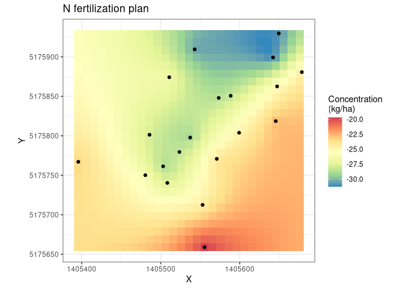
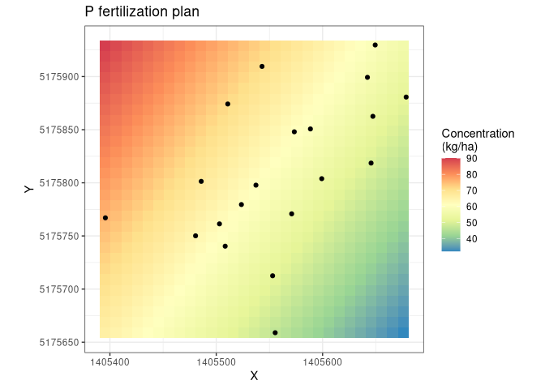
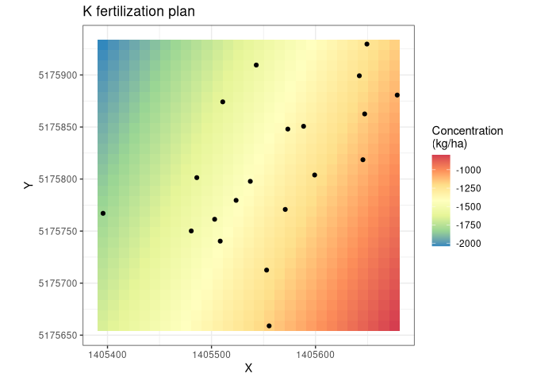
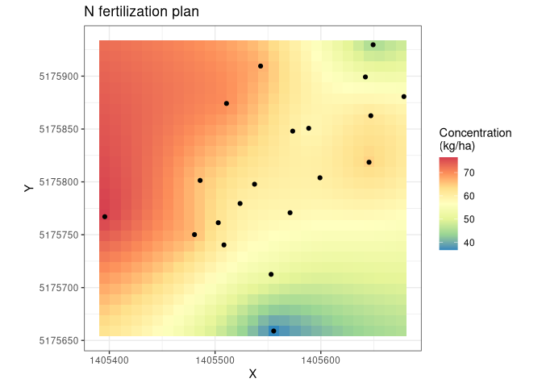
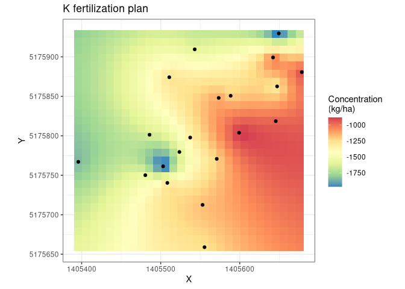

Introduction to `fertplanspatial` R package
================

## Description

The goal of the package is to define fertilization plans for the fields
of a farm and spatialize them. Fertilization plans in the Lazio region
territory have to follow the agronomic guidelines with specific
attention to [attachment no.
2](http://www.regione.lazio.it/binary/rl_main/tbl_documenti/AGC_DD_G01782_24_02_2020_Allegato1.pdf "PDF file of the Attachment 2 of the guidelines")
(Assessorato Agricoltura, Promozione della Filiera e della Cultura del
Cibo, Ambiente e Risorse Naturali 2020) and rely on R package `fertplan`
to perform the raw computations.

## Installation

`fertplanspatial` is currently in active development and not yet on
CRAN, it may be installed from this GitHub repository though:

``` r
# Install remotes package if not yet present in R library
# install.packages("remotes")

remotes::install_github("mbask/fertplanspatial")
```

## Fertilization plans for nitrogen, phosphorus, and potassium nutrients

Nitrogen, phosphorus and potassium are among most needed nutrient
elements by agriculture crops. Their demand depends on a few key factors
including future and past crop type, soil texture, soil organic matter
amount, content in Calcium, amount of rainfall and many others.

The workflow for computing nutrient needs by crops starts with the
analysis of the soil, usually by digging soil samples from the field to
be fertilized. Samples are analysed to reveal their physical and
chemical features that, along with other general variables, enter the
computation of the fertilization components for N, P, and K. Farmers are
interested in knowing the average demand among the sampled points. More
info on this and on the components of the fertilization plans can be
found in the documentation for the `fertplan`
[package](https://github.com/mbask/fertplan).

Averaging nutrient demand between soil samples may give a reasonable
idea of the crop demand but no clear hint at its spatial variation over
the crop area. A few factors may shift nutrient demand over the field
area, such as the presence of water tables under the soil surface, or
the proximity of a hilly area where nutrients can be moved from, or a
previous over- or under-fertilization in localized area, and so on. The
ability to spatialize soil demand concentrations from the soil sample
points over the whole field may allow farmers to precisely calibrate
nutrient spreasing.

### Step 1: compute nutrient demand at soil sample level

We will be using a built-in dataset to demonstrate how to compute and
spatialise a field nutrient demand plan:

``` r
data(soils)
knitr::kable(soils)
```

| id | N\_pc | C\_pc |       CNR | SOM\_pc | P\_ppm | K\_ppm | Limestone\_pc | Clay\_pc |
| -: | ----: | ----: | --------: | ------: | -----: | -----: | ------------: | -------: |
|  1 | 0.139 |  1.33 |  9.568345 |    2.30 |     11 |    449 |          17.4 |       34 |
|  2 | 0.165 |  1.62 |  9.818182 |    2.79 |     14 |    359 |           9.5 |       37 |
|  3 | 0.160 |  1.56 |  9.750000 |    2.69 |     14 |    398 |          12.2 |       40 |
|  4 | 0.164 |  1.61 |  9.817073 |    2.77 |     14 |    492 |          10.3 |       34 |
|  5 | 0.122 |  1.14 |  9.344262 |    1.97 |     21 |    347 |           0.6 |       38 |
|  6 | 0.145 |  1.39 |  9.586207 |    2.40 |     14 |    328 |           6.3 |       40 |
|  7 | 0.159 |  1.55 |  9.748428 |    2.67 |     14 |    355 |           8.7 |       34 |
|  8 | 0.163 |  1.59 |  9.754601 |    2.73 |     15 |    410 |          13.4 |       34 |
|  9 | 0.143 |  1.37 |  9.580420 |    2.36 |     14 |    343 |           9.5 |       37 |
| 10 | 0.152 |  1.47 |  9.671053 |    2.54 |     12 |    394 |          13.4 |       36 |
| 11 | 0.164 |  1.60 |  9.756098 |    2.76 |     14 |    324 |          10.3 |       37 |
| 12 | 0.137 |  1.31 |  9.562044 |    2.25 |     11 |    297 |           5.3 |       40 |
| 13 | 0.173 |  1.70 |  9.826590 |    2.93 |     12 |    398 |          13.0 |       38 |
| 14 | 0.189 |  1.88 |  9.947090 |    3.24 |     15 |    304 |          11.9 |       38 |
| 15 | 0.145 |  1.39 |  9.586207 |    2.40 |     13 |    289 |           2.9 |       40 |
| 16 | 0.162 |  1.58 |  9.753086 |    2.73 |     16 |    351 |          10.3 |       34 |
| 17 | 0.205 |  2.06 | 10.048780 |    3.56 |     20 |    476 |          11.9 |       36 |
| 18 | 0.148 |  1.43 |  9.662162 |    2.47 |     12 |    355 |           5.5 |       39 |
| 19 | 0.154 |  1.49 |  9.675325 |    2.58 |     12 |    351 |          13.0 |       36 |
| 20 | 0.146 |  1.41 |  9.657534 |    2.43 |     14 |    285 |           8.3 |       37 |

This datasets holds the actual soil features of 20 samples digged from a
field in the north of Rome, in 2019. Soil features include:

  - **id**: a simple id for each soil sample
  - **N\_pc**: nitrogen content in %
  - **C\_pc**: carbon content in %
  - **CNR**: carbon / nitrogen ratio
  - **SOM\_pc**: soil organic matter in %
  - **P\_ppm**: phosphorus content in ppm (mg/kg)
  - **K\_ppm**: potassium content in ppm (mg/kg)
  - **Limestone\_pc**: calcium (Ca) content in %
  - **Clay\_pc**: clay content in %

A few more environmental and crop-related variables are still needed.
They can be easily stored in a `R` list:

``` r
soil_vars <- list(
  # Common vars among nitrogen, phosphorus, and potassium
  crop                 = "Girasole", # Sunflower, to be looked up in table 15.2 (page 63)
  part                 = "Frutti",
  expected_yield_kg_ha = 1330L,
  texture              = "Loam", # to be chosen among Sandy, Loam, Clayey
  
  # Additional vars for nitrogen
  
  # Sunflower, to be looked up in table 15.3 (page 67)
  crop_type            = "Girasole",
  # Mixed grassland, less than 5% fabaceae; to be looked up in table 5 (page 24)
  prev_crop            = "Prati: polifita con meno del 5%", 
  # to be looked up in table 4 (page 23)
  drainage_rate        = "slow",
  # Rainfall between October and January in mm
  oct_jan_pr_mm        = 350L,
  n_supply_prev_frt_kg_ha = 0L,
  n_supply_atm_coeff   = 1,

  # Common vars among phosphorus and potassium
  # Depth of tilled soil in cm
  soil_depth_cm        = 30L,
  
  # Additional vars for phosphorus
  crop_class           = "Girasole") # Sunflower, to be looked up in table 10 (page 32)
```

Crop-related variables are looked ip in the Regione Lazio guidelines for
fertilization (see `fertplan`
[package](https://github.com/mbask/fertplan) for more information on the
guidelines). For the sake of simplicity, environmental and crop-related
variables are shared among soil samples. Should it be not the case
`fetplan` package may be used to compute nutrient demands for varying
environmental and crop-related variables.

The first step is to compute the nutrients demand for each soil sample:

``` r
nutrient_dt <- demand_nutrient(soils, soil_vars, nutrient = "all", blnc_cmpt = FALSE)
print(nutrient_dt)
#>     nitrogen_kg_ha phosphorus_kg_ha potassium_kg_ha
#>  1:       -23.4051          83.9776      -1854.4582
#>  2:       -28.9015          60.0745      -1332.6616
#>  3:       -27.7770          61.6540      -1638.2890
#>  4:       -28.6766          60.5425      -2124.7906
#>  5:       -19.6988          19.0504      -1268.5222
#>  6:       -24.5205          58.2025      -1168.7290
#>  7:       -27.5521          59.6065      -1263.4990
#>  8:       -28.2177          56.2408      -1609.2730
#>  9:       -24.0707          60.0745      -1228.7032
#> 10:       -26.0948          74.5864      -1542.9418
#> 11:       -28.5596          60.5425      -1105.2526
#> 12:       -22.8383          74.0677       -960.7810
#> 13:       -30.4667          74.2900      -1603.4698
#> 14:       -31.1401          55.4803       -986.1154
#> 15:       -24.5205          61.5097       -907.1170
#> 16:       -28.2268          48.7957      -1238.3518
#> 17:       -30.9945          25.4893      -2069.9722
#> 18:       -25.3122          68.7325      -1335.4540
#> 19:       -26.5446          74.2900      -1266.5722
#> 20:       -24.8624          59.3725       -851.8540
```

We computed all three macronutrients demands (NPK) by specifying “all”
to the `nutrient` argument. We could have specified one or more nutrient
by simply passing a vector of characters such as `c("nitrogen",
"potassium")`.

### Step 2: spatialise nutrient demands at field level

We will now be using the `soil_spatial` builtin dataset. This dataset
collects nutrient demands for the same 20 soil sample as the `soils`
dataset and includes samples geographic coordinates as “X”, and “Y”:

``` r
data("soils_spatial")
knitr::kable(soils_spatial)
```

| id |       X |       Y |  nitrogen | phosphorus |   potassium |
| -: | ------: | ------: | --------: | ---------: | ----------: |
|  1 | 1405396 | 5175767 | \-23.4051 |    83.9776 | \-1854.4582 |
|  2 | 1405537 | 5175798 | \-28.9015 |    60.0745 | \-1332.6616 |
|  3 | 1405486 | 5175801 | \-27.7770 |    61.6540 | \-1638.2890 |
|  4 | 1405503 | 5175761 | \-28.6766 |    60.5425 | \-2124.7906 |
|  5 | 1405555 | 5175659 | \-19.6988 |    19.0504 | \-1268.5222 |
|  6 | 1405553 | 5175713 | \-24.5205 |    58.2025 | \-1168.7290 |
|  7 | 1405508 | 5175740 | \-27.5521 |    59.6065 | \-1263.4990 |
|  8 | 1405524 | 5175780 | \-28.2177 |    56.2408 | \-1609.2730 |
|  9 | 1405571 | 5175771 | \-24.0707 |    60.0745 | \-1228.7032 |
| 10 | 1405481 | 5175750 | \-26.0948 |    74.5864 | \-1542.9418 |
| 11 | 1405573 | 5175848 | \-28.5596 |    60.5425 | \-1105.2526 |
| 12 | 1405646 | 5175819 | \-22.8383 |    74.0677 |  \-960.7810 |
| 13 | 1405543 | 5175910 | \-30.4667 |    74.2900 | \-1603.4698 |
| 14 | 1405642 | 5175899 | \-31.1401 |    55.4803 |  \-986.1154 |
| 15 | 1405679 | 5175881 | \-24.5205 |    61.5097 |  \-907.1170 |
| 16 | 1405589 | 5175851 | \-28.2268 |    48.7957 | \-1238.3518 |
| 17 | 1405649 | 5175930 | \-30.9945 |    25.4893 | \-2069.9722 |
| 18 | 1405647 | 5175863 | \-25.3122 |    68.7325 | \-1335.4540 |
| 19 | 1405511 | 5175874 | \-26.5446 |    74.2900 | \-1266.5722 |
| 20 | 1405599 | 5175804 | \-24.8624 |    59.3725 |  \-851.8540 |

Spatialisation is carried out by ordinary kriging through the function
`gstat::krige`. Function `spatial_nutrient` is a wrapper around
`gstat::vgm` and `automap::autofitVariogram`. Which function is used
depends on the `model` argument, defaulting to “auto” and, therefore,
`automap::autofitVariogram`. This latter function automagically fit a
variogram to the data whereas the former function enables to fit a
specific variogram, for each specific nutrient for even more
preciseness, by passing the appropriate named arguments to
`spatial_nutrient`. Ordinary kriging is performed on a spatial grid
built on the soil sampling points bounding box by default. Should a
specific grid be needed (ie a larger extent than the one where soils
sampled wrere digged) it should be passed as a \[sp::SpatialPoints()\]
object. We will simply let `automap::autofitVariogram` select the
optimal variogram and pass it to ordinary kriging on the default
bounding box, with a 10 metres spatial resolution:

``` r
spatials_l <- spatial_nutrient(soils_spatial, spat_res = 10)
#> [using ordinary kriging]
#> [using ordinary kriging]
#> [using ordinary kriging]
```

Finally we can plot the spatial distribution of the nutrient
fertilization plans:

``` r
ggplot(as.data.frame(spatials_l$n), aes(x = X, y = Y)) +
  geom_tile(aes(fill = var1.pred)) +
  geom_point(data = as.data.frame(soils_spatial)) +
  coord_equal() +
  scale_fill_distiller(palette = "Spectral") +
  labs(title = "N fertilization plan", fill = "Concentration\n(kg/ha)") +
  theme_bw()
last_plot() %+% as.data.frame(spatials_l$p) %+% labs(title = "P fertilization plan")
last_plot() %+% as.data.frame(spatials_l$k) %+% labs(title = "K fertilization plan")
```



A rough interpretation of the plans clearly suggests that there is a
need for a light fertilization by phosphorus, that potassium is in great
excess and nitrogen is more than enough for the successive crop.

For a greater flexibility the variogram step of the spatialization
process can be specifically tailored to use a specific function among
\[gstat::vgm()\] (controlled by argument `model` set to a specific `vgm`
model) and \[automap::autofitVariogram()\] (controlled by argument
`model = auto`). Further arguments can be passed to either functions:

``` r
spatials_l <- c(
  spatial_nutrient(soils_spatial, model = "auto", spat_res = 10, nutrient = "nitrogen", alpha = seq(0, 359, 15)),
  spatial_nutrient(soils_spatial, model = "Ste",  spat_res = 10, nutrient = "phosphorus"),
  spatial_nutrient(soils_spatial, model = "auto", spat_res = 10, nutrient = "potassium", alpha = seq(0, 359, 30)))
#> [using ordinary kriging]
#> [using ordinary kriging]
#> [using ordinary kriging]
last_plot() %+% as.data.frame(spatials_l$p) %+% labs(title = "N fertilization plan")
last_plot() %+% as.data.frame(spatials_l$p) %+% labs(title = "P fertilization plan")
last_plot() %+% as.data.frame(spatials_l$k) %+% labs(title = "K fertilization plan")
```



```` 

The fertilization plan can be easily converted into a raster stack and saved as GeoTIFF image for further GIS elaboration:

```r
# coerce to SpatialPixelsDataFrame
kriges_spdf_l <- lapply(spatials_l, function(spg) { sp::gridded(spg) <- TRUE; spg })
krige_rs      <- raster::stack(lapply(kriges_spdf_l, raster::raster))
raster::writeRaster(krige_rs, "npk_fert_plans.tif", format = "GTiff")
````

## References

<div id="refs" class="references hanging-indent">

<div id="ref-guidelines2020">

Assessorato Agricoltura, Promozione della Filiera e della Cultura del
Cibo, Ambiente e Risorse Naturali. 2020. “Parte Agronomica, Norme
Generali, Disciplinare Di Produzione Integrata Della Regione Lazio -
SQNPI.” Regione Lazio.
<http://www.regione.lazio.it/rl_agricoltura/?vw=documentazioneDettaglio&id=52065>.

</div>

</div>
