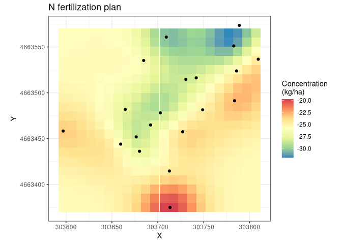
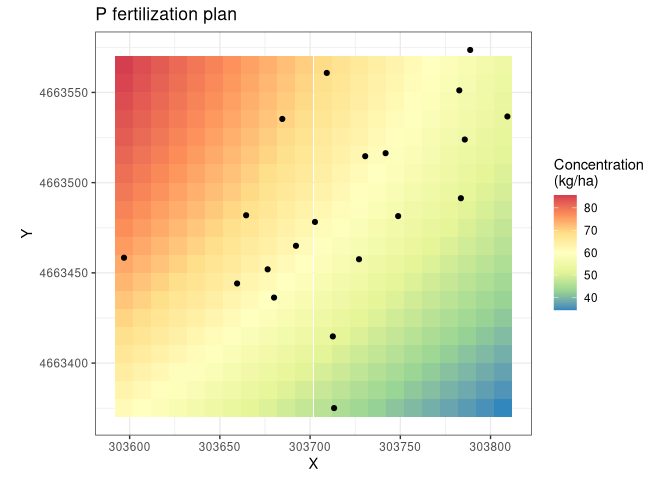
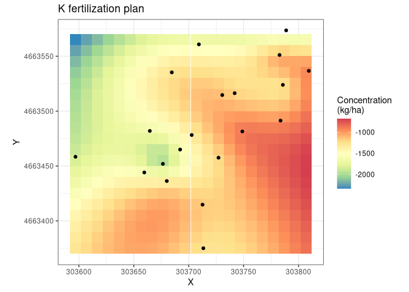

Introduction to `fertplanspatial` R package
================

## Description

The goal of the package is to define fertilization plans for the fields
of a farm and spatialize them. Fertilization plans in the Lazio region
territory have to follow the agronomic guidelines with specific
attention to [attachment no.
2](http://www.regione.lazio.it/binary/rl_main/tbl_documenti/AGC_DD_G01782_24_02_2020_Allegato1.pdf "PDF file of the Attachment 2 of the guidelines")
(Assessorato Agricoltura, Promozione della Filiera e della Cultura del
Cibo, Ambiente e Risorse Naturali 2020) and rely on R package `fertplan`
to perform the raw computations.

## Installation

`fertplanspatial` is currently in active development and not yet on
CRAN, it may be installed from this GitHub repository though:

``` r
# Install remotes package if not yet present in R library
# install.packages("remotes")

remotes::install_github("mbask/fertplanspatial")
```

## Fertilization plans for nitrogen, phosphorus, and potassium nutrients

Nitrogen, phosphorus and potassium are among most needed nutrient
elements by agriculture crops. Their demand depends on a few key factors
including future and past crop type, soil texture, soil organic matter
amount, content in Calcium, amount of rainfall and many others.

The workflow for computing nutrient needs by crops starts with the
analysis of the soil, usually by digging soil samples from the field to
be fertilized. Samples are analysed to reveal their physical and
chemical features that, along with other general variables, enter the
computation of the fertilization components for N, P, and K. Farmers are
interested in knowing the average demand among the sampled points. More
info on this and on the components of the fertilization plans can be
found in the documentation for the `fertplan`
[package](https://github.com/mbask/fertplan).

Averaging nutrient demand between soil samples may give a reasonable
idea of the crop demand but no clear hint at its spatial variation over
the crop area. A few factors may shift nutrient demand over the field
area, such as the presence of water tables under the soil surface, or
the proximity of a hilly area where nutrients can be moved from, or a
previous over- or under-fertilization in localized area, and so on. The
ability to spatialize soil demand concentrations from the soil sample
points over the whole field may allow farmers to precisely calibrate
nutrient spreasing.

We will now be using the `soil_spatial` builtin dataset. This dataset
collects nutrient demands for the same 20 soil sample as the `soils`
dataset in package `fertplan` and includes samples geographic
coordinates as “X”, and “Y”:

``` r
data("soils_spatial")
knitr::kable(soils_spatial)
```

| id |        X |       Y |  nitrogen | phosphorus |   potassium |
| -: | -------: | ------: | --------: | ---------: | ----------: |
|  1 | 303596.9 | 4663458 | \-23.4051 |    83.9776 | \-1854.4582 |
|  2 | 303702.7 | 4663478 | \-28.9015 |    60.0745 | \-1332.6616 |
|  3 | 303664.6 | 4663482 | \-27.7770 |    61.6540 | \-1638.2890 |
|  4 | 303676.5 | 4663452 | \-28.6766 |    60.5425 | \-2124.7906 |
|  5 | 303713.3 | 4663375 | \-19.6988 |    19.0504 | \-1268.5222 |
|  6 | 303712.6 | 4663415 | \-24.5205 |    58.2025 | \-1168.7290 |
|  7 | 303680.0 | 4663436 | \-27.5521 |    59.6065 | \-1263.4990 |
|  8 | 303692.2 | 4663465 | \-28.2177 |    56.2408 | \-1609.2730 |
|  9 | 303727.1 | 4663458 | \-24.0707 |    60.0745 | \-1228.7032 |
| 10 | 303659.5 | 4663444 | \-26.0948 |    74.5864 | \-1542.9418 |
| 11 | 303730.5 | 4663515 | \-28.5596 |    60.5425 | \-1105.2526 |
| 12 | 303783.6 | 4663491 | \-22.8383 |    74.0677 |  \-960.7810 |
| 13 | 303709.3 | 4663561 | \-30.4667 |    74.2900 | \-1603.4698 |
| 14 | 303782.7 | 4663551 | \-31.1401 |    55.4803 |  \-986.1154 |
| 15 | 303809.3 | 4663537 | \-24.5205 |    61.5097 |  \-907.1170 |
| 16 | 303741.8 | 4663516 | \-28.2268 |    48.7957 | \-1238.3518 |
| 17 | 303788.7 | 4663574 | \-30.9945 |    25.4893 | \-2069.9722 |
| 18 | 303785.7 | 4663524 | \-25.3122 |    68.7325 | \-1335.4540 |
| 19 | 303684.6 | 4663535 | \-26.5446 |    74.2900 | \-1266.5722 |
| 20 | 303748.8 | 4663481 | \-24.8624 |    59.3725 |  \-851.8540 |

Spatialisation is carried out by ordinary kriging through the function
`gstat::krige`. Function `spatial_nutrient` is a wrapper around
`gstat::vgm` and `automap::autofitVariogram`. Which function is used
depends on the `model` argument, defaulting to “auto” and, therefore,
`automap::autofitVariogram`. This latter function automagically fit a
variogram to the data whereas the former function enables to fit a
specific variogram, for each specific nutrient for even more
preciseness, by passing the appropriate named arguments to
`spatial_nutrient`. Ordinary kriging is performed on a spatial grid
built on the soil sampling points bounding box by default. Should a
specific grid be needed (ie a larger extent than the one where soils
sampled were dug) it should be passed as a `sp::SpatialPoints()` object.
We will simply let `automap::autofitVariogram` select the optimal
variogram and pass it to ordinary kriging on the default bounding box,
with a 10 metres spatial resolution:

``` r
spatials_l <- spatial_nutrient(soils_spatial, spat_res = 10)
#> [using ordinary kriging]
#> [using ordinary kriging]
#> [using ordinary kriging]
```

Finally we can plot the spatial distribution of the nutrient
fertilization plans:

``` r
ggplot(as.data.frame(spatials_l$n), aes(x = X, y = Y)) +
  geom_tile(aes(fill = var1.pred)) +
  geom_point(data = as.data.frame(soils_spatial)) +
  coord_equal() +
  scale_fill_distiller(palette = "Spectral") +
  labs(title = "N fertilization plan", fill = "Concentration\n(kg/ha)") +
  theme_bw()
last_plot() %+% as.data.frame(spatials_l$p) %+% labs(title = "P fertilization plan")
last_plot() %+% as.data.frame(spatials_l$k) %+% labs(title = "K fertilization plan")
```



A rough interpretation of the plans clearly suggests that there is a
need for a light fertilization by phosphorus, that potassium is in great
excess and nitrogen is more than enough for the successive crop.

For a greater flexibility the variogram step of the spatialization
process can be specifically tailored to use a specific function among
\[gstat::vgm()\] (controlled by argument `model` set to a specific `vgm`
model) and \[automap::autofitVariogram()\] (controlled by argument
`model = auto`). Further arguments can be passed to either functions:

``` r
spatials_l <- c(
  spatial_nutrient(soils_spatial, model = "auto", spat_res = 10, nutrient = "nitrogen", alpha = seq(0, 359, 15)),
  spatial_nutrient(soils_spatial, model = "Ste",  spat_res = 10, nutrient = "phosphorus"),
  spatial_nutrient(soils_spatial, model = "auto", spat_res = 10, nutrient = "potassium", alpha = seq(0, 359, 15)))
#> [using ordinary kriging]
#> [using ordinary kriging]
#> [using ordinary kriging]
last_plot() %+% as.data.frame(spatials_l$n) %+% labs(title = "N fertilization plan")
last_plot() %+% as.data.frame(spatials_l$p) %+% labs(title = "P fertilization plan")
last_plot() %+% as.data.frame(spatials_l$k) %+% labs(title = "K fertilization plan")
```



The fertilization plan can be easily converted into a raster stack and
saved as GeoTIFF image for further GIS elaboration:

``` r
# coerce to SpatialPixelsDataFrame
kriges_spdf_l <- lapply(spatials_l, function(spg) { sp::gridded(spg) <- TRUE; spg })
krige_rs      <- raster::stack(lapply(kriges_spdf_l, raster::raster))
raster::writeRaster(krige_rs, "npk_fert_plans.tif", format = "GTiff")
```

## References

<div id="refs" class="references hanging-indent">

<div id="ref-guidelines2020">

Assessorato Agricoltura, Promozione della Filiera e della Cultura del
Cibo, Ambiente e Risorse Naturali. 2020. “Parte Agronomica, Norme
Generali, Disciplinare Di Produzione Integrata Della Regione Lazio -
SQNPI.” Regione Lazio.
<http://www.regione.lazio.it/rl_agricoltura/?vw=documentazioneDettaglio&id=52065>.

</div>

</div>
